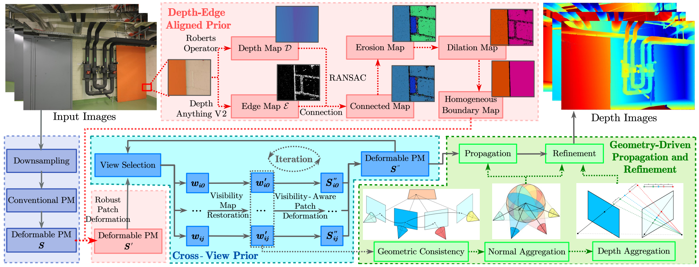

# DVP-MVS

Zhenlong Yuan, Jingguo luo, Fei Shen, Zhaoxin Li, Cong Liu, Tianlu Mao and Zhaoqi Wang, [**DVP-MVS: Synergize Depth-Edge and Visibility Prior for Multi-View Stereo**](https://arxiv.org/pdf/2412.11578), AAAI 2025.


## About
DVP-MVS is the first method who combines the instance segmentation model **SAM** with multi-view stereo(**MVS**) algorithm to address limited receptive field of PatchMatch-based MVS.

Our paper was accepted by **AAAI2025**!

If you find this project useful for your research, please cite:  

```
@InProceedings{DVP-MVS,
  title = {{{DVP-MVS}}: {{Synergize Depth-Edge}} and {{Visibility Prior}} for {{Multi-View Stereo}}},
  shorttitle = {{{DVP-MVS}}},
  author = {Yuan, Zhenlong and Luo, Jinguo and Shen, Fei and Li, Zhaoxin and Liu, Cong and Mao, Tianlu and Wang, Zhaoqi},
  year = {2024},
  month = dec,
  number = {arXiv:2412.11578},
  eprint = {2412.11578},
  primaryclass = {cs},
  publisher = {arXiv},
  archiveprefix = {arXiv}
}
```
## Code
Code is coming soon.

## Acknowledgements

This code largely benefits from the following repositories: [APD-MVS](https://github.com/whoiszzj/APD-MVS), [Depth-Anything-V2](https://github.com/DepthAnything/Depth-Anything-V2) and [ACMMP](https://github.com/GhiXu/ACMMP.git). Thanks to their authors for opening the source of their excellent works.
